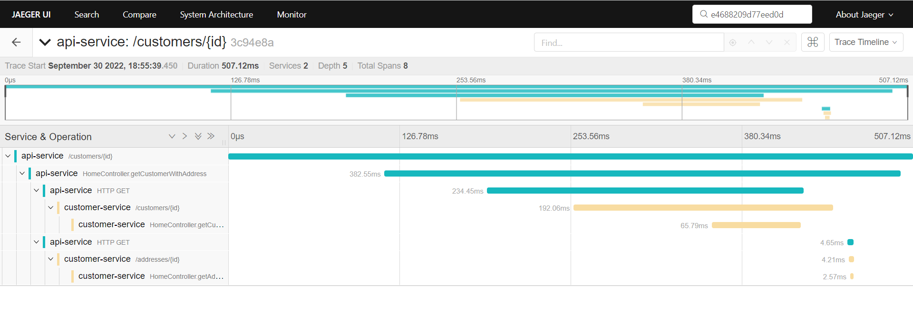
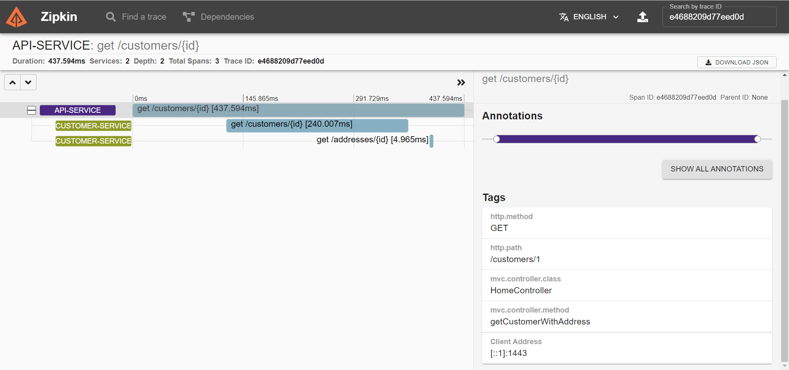

> 主要参考文章：https://reflectoring.io/spring-boot-tracing/

### 1. Install OpenTelemetry

 - Download OpenTelemetry Collector from

   - https://opentelemetry.io/docs/collector/getting-started/#windows-packaging
   - https://github.com/open-telemetry/opentelemetry-collector-releases/releases

 - Start otel-collector

   ```
   otelcol.exe --config=./otel-collector-config.yaml
   ```

   ```yaml
   # otel-collector-config.yaml
   receivers:
     # Make sure to add the otlp receiver.
     # This will open up the receiver on port 4317
     otlp:
       protocols:
         grpc:
           endpoint: "0.0.0.0:4317"
   processors:
   extensions:
     health_check: {}
   exporters:
     jaeger:
       endpoint: "http://localhost:14250/"
     zipkin:
       endpoint: "http://localhost:9411/api/v2/spans"
     logging:
       loglevel: debug
   service:
     extensions: [health_check]
     pipelines:
       traces:
         receivers: [otlp]
         processors: []
         exporters: [jaeger, zipkin, logging]
   ```


### 2. Install Jaeger

- Download Jaeger from https://www.jaegertracing.io/docs/1.38/getting-started/
- Use CMD to run `jaeger-all-in-one.exe`
- You can then navigate to `http://localhost:16686` to access the Jaeger UI.


### 3. Install Zipkin

If you have Java 8 or higher installed, the quickest way to get started is to fetch the [latest release](https://search.maven.org/remote_content?g=io.zipkin&a=zipkin-server&v=LATEST&c=exec) as a self-contained executable jar:

```sh
# Install
curl -sSL https://zipkin.io/quickstart.sh | bash -s
# Run
java -jar zipkin.jar
```


### 4. Start Spring Application

You can download the code from https://github.com/cainzhong/spring-cloud-sleuth-poc.

1. Start `api-service` with VM options:

   ```
   -javaagent:C:/Dev/repository/tzhong/tzhong/spring-cloud-sleuth-poc/otel-collector/opentelemetry-javaagent.jar
   -Dotel.service.name=api-service
   -Dotel.traces.exporter=jaeger
   -Dotel.exporter.jaeger.endpoint=http://localhost:14250
   -Dotel.javaagent.debug=true
   ```

2. Start `customer-service` with VM options:

   ```
   -javaagent:C:/Dev/repository/tzhong/tzhong/spring-cloud-sleuth-poc/otel-collector/opentelemetry-javaagent.jar
   -Dotel.service.name=customer-service -Dotel.traces.exporter=jaeger 
   -Dotel.exporter.jaeger.endpoint=http://localhost:14250 
   -Dotel.javaagent.debug=true
   ```

   

### 5. Test

```sh
curl --location --request GET 'http://localhost:9090/customers/1'
```


### 6. Open Jaeger or ZipKin

- You can then navigate to `http://localhost:16686` to access the Jaeger UI.

  

- You can then navigate to `http://127.0.0.1:9411/` to access the ZipKin UI.

  


## Reference

1. 微服务追踪：Spring Cloud Sleuth
   - https://www.jianshu.com/p/4303385b7512
   - https://spring.io/projects/spring-cloud-sleuth
   - https://blog.csdn.net/xibei19921101/article/details/119736123

2. Not seeing traceids in the http response headers.
   - From the security perspective, it is not too safe. spring-cloud-sleuth remove it officially.
     - https://github.com/spring-cloud/spring-cloud-sleuth/issues/424

3. ZipKin
   - https://zipkin.io/pages/quickstart

4. OpenTelemetry

   - Download OpenTelemetry Collector https://opentelemetry.io/docs/collector/getting-started/#windows-packaging

   - otel-collector-config.yaml

     - https://opentelemetry.io/docs/collector/configuration/

   - Automatic Instrumentation

     - https://opentelemetry.io/docs/instrumentation/java/automatic/
     - https://opentelemetry.io/docs/instrumentation/java/getting-started/

5. Jaeger
   - https://www.jaegertracing.io/docs/1.38/getting-started/
   - OpenTelemetry SDK Autoconfigure: Jaeger exporter
     - https://github.com/open-telemetry/opentelemetry-java/blob/main/sdk-extensions/autoconfigure/README.md#jaeger-exporter

6. Comparing Jaeger and Zipkin
   - https://signoz.io/blog/jaeger-vs-zipkin/#:~:text=Jaeger%20can%20be%20deployed%20as,query%20service%2C%20and%20web%20UI.

7. Spring Cloud Sleuth OTel Features
   - https://spring-projects-experimental.github.io/spring-cloud-sleuth-otel/docs/current/reference/html/index.html

8. Easy Distributed Tracing with Spring Cloud Sleuth
   - https://developer.okta.com/blog/2021/07/26/spring-cloud-sleuth

9. How to capture Spring Boot metrics with the OpenTelemetry Java Instrumentation Agent
   - https://grafana.com/blog/2022/05/04/how-to-capture-spring-boot-metrics-with-the-opentelemetry-java-instrumentation-agent/

